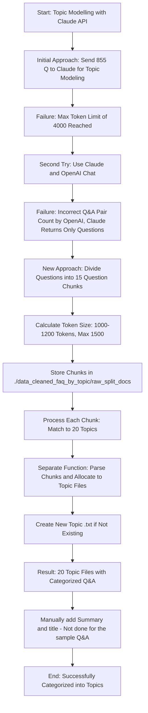

# PoppyChat

## Data Preparation:
### Workflow Steps

1. **Run `extract_web_list.py`**
   - **Inputs**: `website_list.txt` (contains a list of websites)
   - **Processes**: Extracts content from the websites listed in `website_list.txt`
   - **Outputs**: Text files saved in the `blogs` folder

2. **Execute `convert_to_QA.ipynb` Notebook**
   - **Inputs**: Text files from the `blogs` folder
   - **Processes**: Generates Q&A pairs using LangChain
   - **Outputs**: `clean_faq_dataset.txt` (contains Q&A pairs)

3. **Final Output**
   - The Q&A pairs stored in `clean_faq_dataset.txt` can be used for training models or other purposes.

```
          extract_web_list.py      convert_to_QA.ipynb
Website List ─────────────> Text Files ─────────────> Q&A Pairs
   (website_list.txt)            (blogs folder)          (clean_faq_dataset.txt)
```


#### Topic Modelling with Claude API
 - `claude_topic_modelling.ipynb` notebook has the code that categorizes each of the ~850 question into 20 provide categories
 - First try was to accomplish this by providing Claude the entire 850 question list. This did not work because Claude API max_token = 4000
 - Second try was to accomplish this using the Chat both with Claude and the OpenAI. This approach also did not work. OpeanAI did not calculate the number of Q&A pairs correctly. Claude would only return the questions.
 - Next approach was to use Claude API in a different manner. Voiceflow Knowledge base default chunk is 1000 tokens. It has a range of 500 to 1500 chunks. Q&A data set is uniform so so I calculated the total size and figured out that about 15 questions are between 1000 - 1200 tokens. Never more then 1500. Considering this I divided the large Q&A doc to 15 question increments. The list is under `./data_cleaned_faq_by_topic/raw_split_docs`
 - claude topic modelling call takes in each 15 question chunk, matches the questions one by one to the 20 topics I provided. Then a seperate function parses these chunks and places them into proper topic txt file. If a topic txt file doe snot exist it creates a new one. This way I am able to do topic modelling and have 20 txt docs with related Q&A questions. 

#### Topic Modelling with Claude API Process Flow


#### Finetuning Mistral for behaviour change to Q&A.
- Initial runs using OPENAI for all requests turned out to be super expensive. On average one conversation flow cost ~ 1M tokens. It also impacted overall results since I was trying to save some tokens by providing shorter instructions/prompts. For this reason I thought a finetuned Mistral model would be more cost effective. below outlines my approach and result from this experiment. TL/DR: Because of cost and not mind blowing results I decided to not go with finetuning. 
- convert the `clean_faq_dataset.txt` file to a dictionary format that can be used to train Mistral 7B Instruct. `{<User>: Q: <xxx> <bot>: A: <xxx>}`
- Finetuning for all 855 questions takes anywhere from 7 to 9 mins for Mistral 7B model. Cost ~ 12 bucks for each run for Mistral 7B
- The results were less then stellar. It takes a long time to bring the model online. So if it shuts off, it will be at least 10 to 15 minutes until it comes back online. It is not possible to shut down and then bring it back up when needed. Also, there is only one option for GPPU - L4.
- In conclusion: Finetuned Mistral 7B also did not work great. Definitely less then stellar performance. It would reapeat words, had issues with fully understanding the relation between question and provided chunks. Code and results are in `fine_tune_mistral_togetherai.ipynb` notebook.
- For this reason I moved to Mixtral 8x7B - Instruct and instead of finetuning I used a base model and improved my instructions and NLU logic. 


###  Other ideas I considered:
##### Build a vector db from the Q&A data set:
 To use with the the Voiceflow Dialog API to answer questions from a Vector DB such as Qdrand - I decided against this since Voiceflow already provides a free use of their Vector DB. Also I would need more processing power to get an external DB run faster. This coupled with the time it takes to make an API call also increases the overall latency. There is no cost to adding to Voiceflow Knowledge Base. Also Voiceflow will be easier to maintain for the user. Afterall **the end user does not care I used Qdrant or Pinecone for my database. They dont care if the front end is done in Chainlit, Streamlit or Voiceflow. They want a performent chatbot that produces the right info in a short time and looks pretty.*** The main goal of the business practice is to provide an incredible service at the right price. 


### Chatbot: (v2 is on the way!!!)
https://poppykids-4ea4532ed336b911edaa144d4b73d.webflow.io

