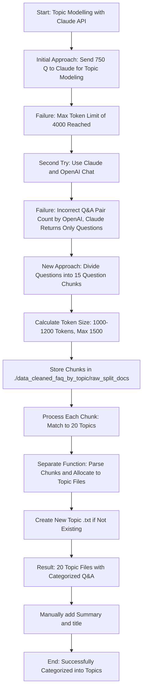

# PoppyChat

## Data Preparation:
### Workflow Steps

1. **Run `extract_web_list.py`**
   - **Inputs**: `website_list.txt` (contains a list of websites)
   - **Processes**: Extracts content from the websites listed in `website_list.txt`
   - **Outputs**: Text files saved in the `blogs` folder

2. **Execute `convert_to_QA.ipynb` Notebook**
   - **Inputs**: Text files from the `blogs` folder
   - **Processes**: Generates Q&A pairs using LangChain
   - **Outputs**: `faq_training.txt` (contains Q&A pairs)

3. **Final Output**
   - The Q&A pairs stored in `faq_training.txt` can be used for training models or other purposes.

```
          extract_web_list.py      convert_to_QA.ipynb
Website List ─────────────> Text Files ─────────────> Q&A Pairs
   (website_list.txt)            (blogs folder)          (faq_training.txt)
```


#### Topic Modelling with Claude API
 - `claude_topic_modelling.ipynb` notebook has the code that categorizes each of the ~750 question into 20 provide categories
 - First try was to accomplish this by providing Claude the entire 750 question list. This did not work because Claude API max_token = 4000
 - Second try was to accomplish this using the Chat both with Claude and the OpenAI. This approach also did not work. OpeanAI did not calculate the number of Q&A pairs correctly. Claude would only return the questions.
 - Next approach was to use Claude API in a different manner. Voiceflow Knowledge base default chunk is 1000 tokens. It has a range of 500 to 1500 chunks. Q&A data set is uniform so so I calculated the total size and figured out that about 15 questions are between 1000 - 1200 tokens. Never more then 1500. Considering this I divided the large Q&A doc to 15 question increments. The list is under `/Users/acrobat/Documents/GitHub/extract_html/data_cleaned_faq_by_topic/raw_split_docs`
 - claude topic modelling call takes in each 15 question chunk, matches the questions one by one to the 20 topics I provided. Then a seperate function parses these chunks and places them into proper topic txt file. If a topic txt file doe snot exist it creates a new one. This way I am able to do topic modelling and have 20 txt docs with related Q&A questions. 

#### Topic Modelling with Claude API Process Flow


# Next is to convert the `faq_training.txt` file to a format that can be used to train MIstral 7B Instruct.


# Other potential tasks:
# Build a vector db from the Q&A data set and then use the Voiceflow API to answer questions from a Vector DB like Qdrand - Not sure this is necessary since Voiceflow already provides a free use of their Vector DB. Also Voiceflow version will be easier to maintain for the user.
Steps are: 
Create a new free Qdrant cloud cluster
Use pdfplumber to extract text from PDF and create embeddings - Using txt
Use Qdrant to index the embeddings - Voiceflow does automatically - check the embedding they use - probabaly free version
Use Qdrant to search for the most similar embeddings based on a users input - Voiceflow similarity search
Generate a response based on the most similar embedding - 
